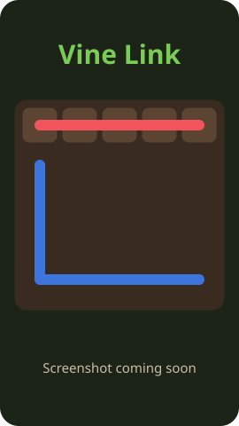

# Vine Link

A calm, cozy garden puzzle for your phone. Grow vines to link matching flower seeds, cover every
patch of soil, and watch the garden bloom.

<p align="center">
  
</p>

**Play it:** https://tejas28599-ship-it.github.io/vine-link/

Plain HTML, CSS and vanilla JavaScript with no frameworks, dependencies or build step. It installs as a PWA and works offline.

## How to play

1. **Drag from a seed** to the other seed of the same color to grow a vine between them.
2. Vines move up, down, left and right. They **can't cross or overlap**. Draw over another vine
   and it gets cut back.
3. Drag back along a vine to shorten it. **Tap a seed** to clear its vine.
4. The garden blooms when **every pair is linked and every cell is filled**.

### Along the way

| Pack     | Grid          | New idea |
|----------|---------------|----------|
| Seedling | 5×5 – 6×6     | Levels 1–3 are a gentle tutorial |
| Sprout   | 7×7 – 8×8     | **Rocks**: vines must grow around them |
| Blossom  | 9×9 – 10×10   | **Bridges**: one vine crosses left–right, another top–bottom |
| Grove    | 11×11 – 12×12 | Long, winding vines |

- **Watering can (hint):** grows one correct vine for you, 3 per level.
- **Perfect leaf:** solve a level drawing each pair exactly once.
- **Daily Garden:** a new puzzle every day, seeded by the date, so everyone gets the same one.
- **Colorblind mode:** every flower gets its own symbol and petal shape.
- Every level has **exactly one solution** (checked by the solver when it's generated and again in the test suite).

## Run it locally

ES modules and the service worker need a real web server (opening `index.html` as a file won't
work). Any static server is fine:

```bash
node tools/serve.js
```

Then open http://localhost:8080. Alternatives: `python3 -m http.server 8080` or `npx serve`.

To test on your phone, serve on your LAN (e.g. `python3 -m http.server 8080 --bind 0.0.0.0`) and
open `http://<your-computer-ip>:8080`. Add `?debug` to the URL to expose `window.__vine` in the console.

### Tests

Needs Node 18+ and nothing else:

```bash
npm test
```

The suites cover the rules engine (cutting, shrinking, bridges, undo, hints, save/restore),
storage, gap-free swipe traversal, and **all 120 levels** (unique solution, solver speed,
difficulty curve, deterministic generation, Daily Garden).

### Regenerating levels

Levels come from a seeded generator, so level N is always the same. They are pre-generated into
`levels.json` (big grids take a while to prove unique):

```bash
npm run generate            # all 120 levels, uses every CPU core
node tools/generate-levels.js 91 120   # just a range
```

If `levels.json` can't be loaded, the game generates the same levels in the browser.

## Project layout

```
index.html          screens, HUD, dialogs
css/style.css       theme + responsive layout (safe areas, 360px phones → tablets)
js/game.js          pure rules: lane graph, vines, cutting, undo, win check, hints
js/solver.js        backtracking solver (counts solutions → uniqueness)
js/levels.js        seeded RNG, generator, packs, difficulty curve, Daily Garden
js/render.js        canvas renderer: soil, grass, wiggly vines, blooms, magnifier, petals
js/input.js         pointer input, single-finger, supercover swipe traversal
js/audio.js         Web Audio synthesized sound effects
js/storage.js       localStorage (every access wrapped in try/catch)
js/app.js           screens + glue
sw.js, manifest.json  PWA (offline cache, install)
tools/              level generator, icon maker, tiny static server
tests/              node --test suites
docs/DESIGN.md      original design proposal (data model, palette, build order)
```

## Deploying

The repo is served by GitHub Pages straight from `main` (root). When you change cached files, bump
`VERSION` in `sw.js`. The service worker fetches network-first, so players get updates right
away and fall back to the cache when offline.
